# Parcial 1 - Desarrollo de Aplicaciones Web y Móviles

Este repositorio contiene la solución completa del primer examen parcial, compuesto por dos aplicaciones independientes construidas con React, cumpliendo con las especificaciones de persistencia local en `localStorage`, navegación y reglas de diseño solicitadas.

---

## Estructura del Repositorio

```text
Parcial1/
├── PWA React/          # Ejercicio 1: Aplicación Web Progresiva para Administración de Pacientes
├── Ionic App/          # Ejercicio 2: Aplicación Móvil en Ionic React para Consulta de Visitas Médicas
├── screenshots/        # Evidencias visuales de la ejecución de ambos ejercicios
├── .gitignore          # Exclusión de node_modules, compilados y artefactos de Android
└── README.md           # Documentación técnica, galería y guía de ejecución
```

---

## Ejercicio 1 — PWA React (Administración de Pacientes)

Aplicación web progresiva desarrollada con React y Vite orientada a la gestión de pacientes en un entorno clínico.

### 1. Funcionalidades Implementadas
- **Autenticación (Login)**:
  - Manejo de usuarios predefinidos en código (`src/data/defaultUsers.js`).
  - Almacenamiento seguro del estado de sesión en `localStorage` (`auth_user`).
  - Recuperación automática de la sesión al recargar la página.
  - Cierre de sesión (Logout) con limpieza de almacenamiento.
  - Validación de campos requeridos y mensaje de error en pantalla ante credenciales incorrectas.
- **Gestión de Pacientes**:
  - Listado dinámico de pacientes con persistencia en `localStorage` (`patients_data`).
  - Formulario de alta con campos: Nombre, Apellido, Cédula de Ciudadanía (CC) y Teléfono.
  - Validaciones estrictas:
    - Nombre y Apellido: obligatorios y solo caracteres alfabéticos.
    - Cédula (CC): obligatoria, numérica y única (no duplicada).
    - Teléfono: opcional, formato numérico válido.
- **Búsqueda en Tiempo Real**:
  - Filtro por coincidencia de Nombre, Apellido o Cédula.
  - **Requisito arquitectónico**: El estado del buscador reside en el componente padre (`DashboardPage.jsx`) y la lista filtrada se transmite mediante `props` al componente hijo (`PatientTable.jsx`).
- **Capacidades PWA**:
  - Manifiesto web configurado (`manifest.json`) con tema y accesos directos.
  - Service Worker registrado (`sw.js`) para soporte y caché sin conexión.
  - Botón interactivo de instalación en el encabezado.

### 2. Evidencias Visuales (PWA React)

#### Inicio de Sesión y Manejo de Errores
| Pantalla de Login | Error por Credenciales Inválidas |
| :---: | :---: |
| 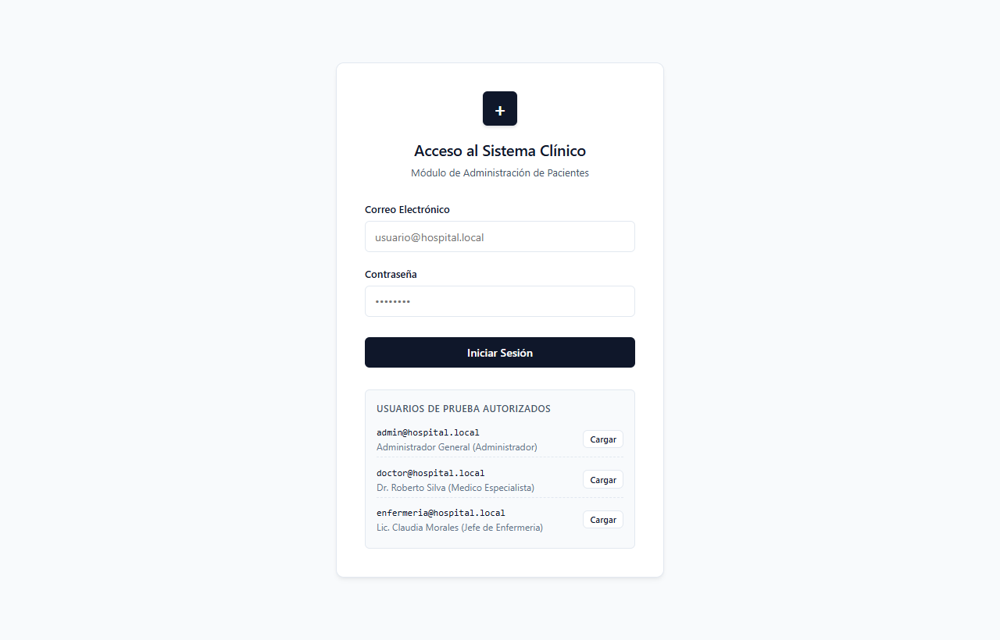 | 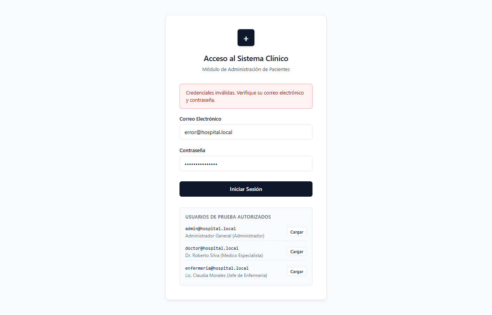 |

#### Panel de Control y Búsqueda en Tiempo Real
| Dashboard con Listado de Pacientes | Búsqueda Filtrada (Padre a Hijo) |
| :---: | :---: |
| 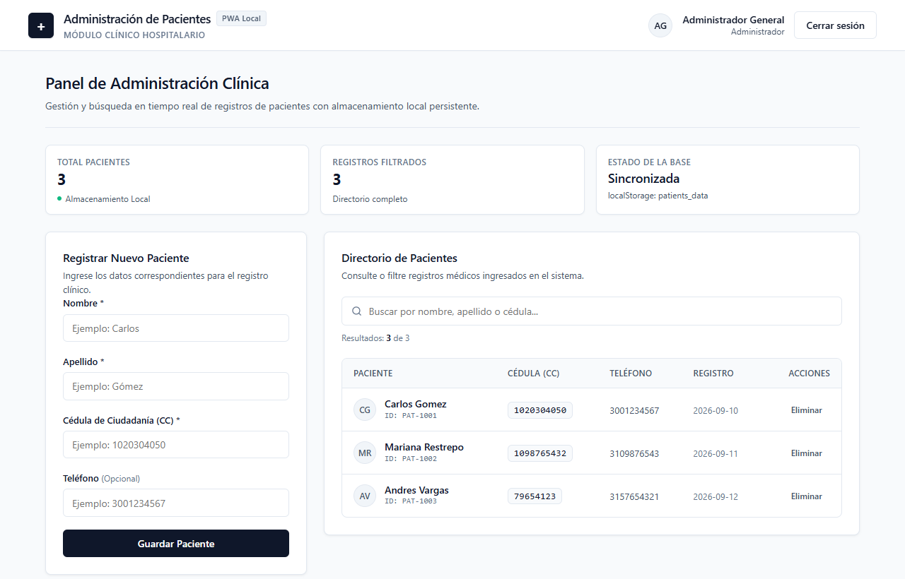 | 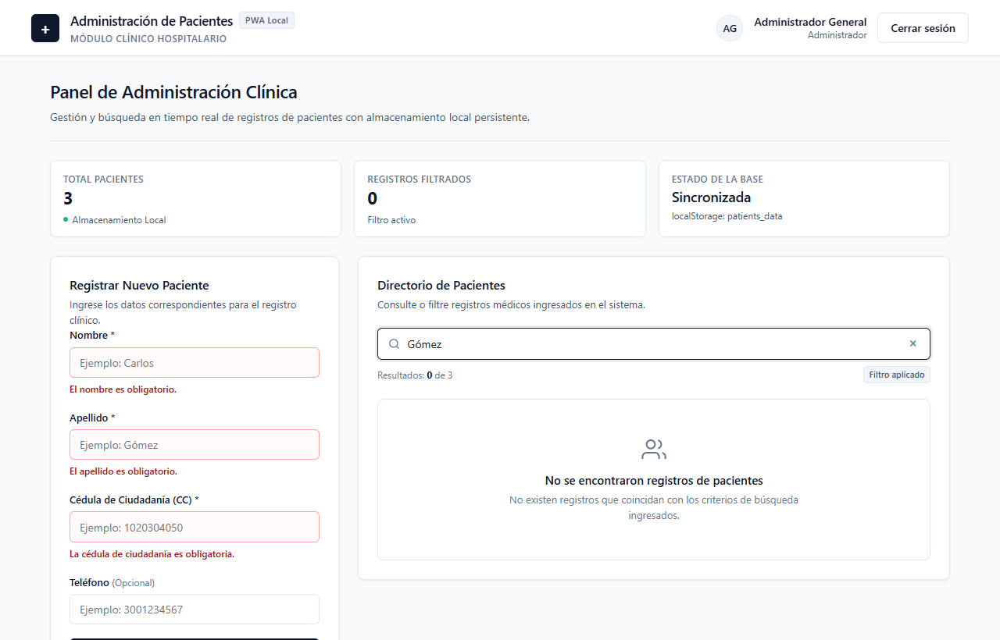 |

#### Formulario y Validación de Pacientes
| Validaciones de Campos Obligatorios y Cédula |
| :---: |
| 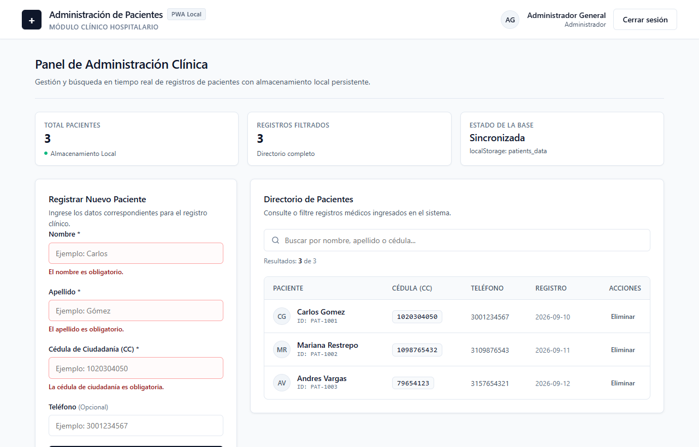 |

### 3. Credenciales de Prueba (PWA React)
- **Usuario**: `admin@hospital.local` | **Contraseña**: `admin123`
- **Usuario**: `medico@hospital.local` | **Contraseña**: `medico2026`
- **Usuario**: `recepcion@hospital.local` | **Contraseña**: `recepcion1`

### 4. Instrucciones de Ejecución
```bash
cd "PWA React"
npm install
npm run dev
```
La aplicación iniciará localmente en: `http://localhost:5173/`

---

## Ejercicio 2 — Ionic App (Consulta de Visitas Médicas)

Aplicación móvil desarrollada con Ionic React (`@ionic/react` v8, React 18, `@ionic/react-router` y `react-router-dom` v5) enfocada en la consulta y gestión de visitas médicas domiciliarias.

### 1. Funcionalidades Implementadas
- **Inicio de Sesión (Login)**:
  - Autenticación con credencial institucional fija.
  - Notificación de alerta mediante `IonToast` ante credenciales erróneas ("Credenciales incorrectas").
  - Persistencia de sesión en `localStorage` (`ionic_auth_user`).
- **Navegación por Pestañas (IonTabs)**:
  - **Visitas**: Agenda del día con visualización de citas, horario, paciente, motivo, dirección e insignias de estado. Incluye soporte para recarga mediante deslizamiento (`IonRefresher`).
  - **Pacientes**: Directorio con buscador nativo (`IonSearchbar`) por nombre, cédula o aseguradora EPS.
  - **Perfil**: Datos institucionales del médico (Tarjeta Profesional, Sede, Correo) y botón de cierre de sesión.
- **Detalle de Visita y Estados**:
  - Ruta parametrizada por identificador: `/visitas/:id`.
  - Selector de estado de atención mediante `IonSegment`, con transición restringida entre: `pendiente`, `en_camino` y `finalizada`.
  - Actualización inmediata en `localStorage` (`ionic_visitas_data`) y confirmación mediante `IonToast`.
  - Enlace de marcación telefónica directa (`tel:`).
- **Soporte Nativo Android (Capacitor)**:
  - Proyecto Android configurado y sincronizado con `@capacitor/android`.
  - Generación de instalador compilado `app-debug.apk`.

### 2. Evidencias Visuales (Ionic App)

#### Acceso Móvil y Alerta de Error
| Pantalla de Login Móvil | Alerta IonToast (Credenciales Incorrectas) |
| :---: | :---: |
| 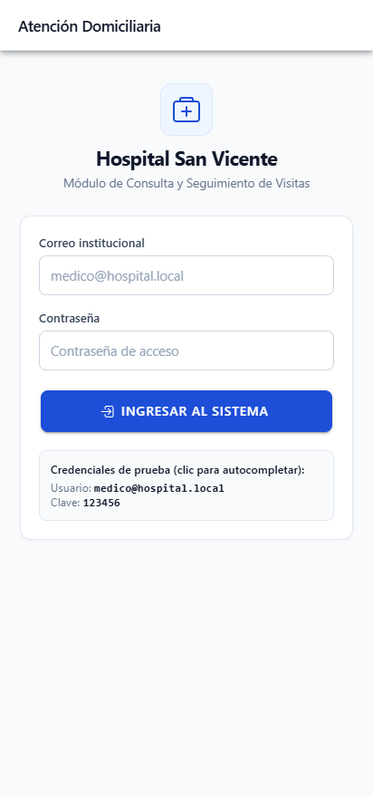 | 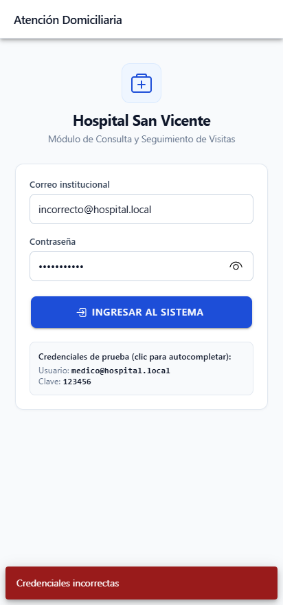 |

#### Tab 1: Agenda de Visitas y Filtro por Estado
| Agenda Completa de Visitas | Filtro por Estado (En camino) |
| :---: | :---: |
| 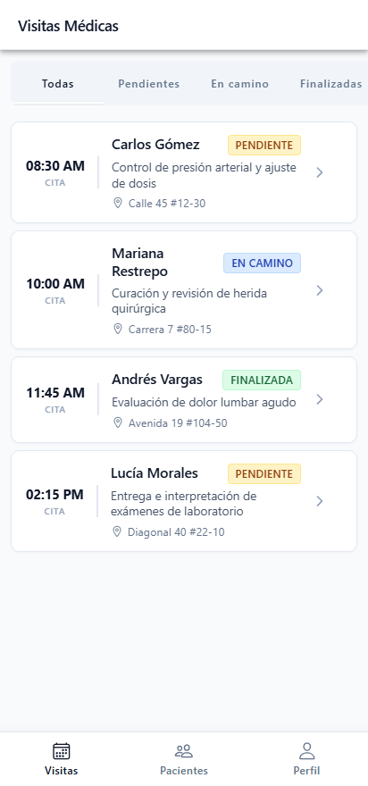 | 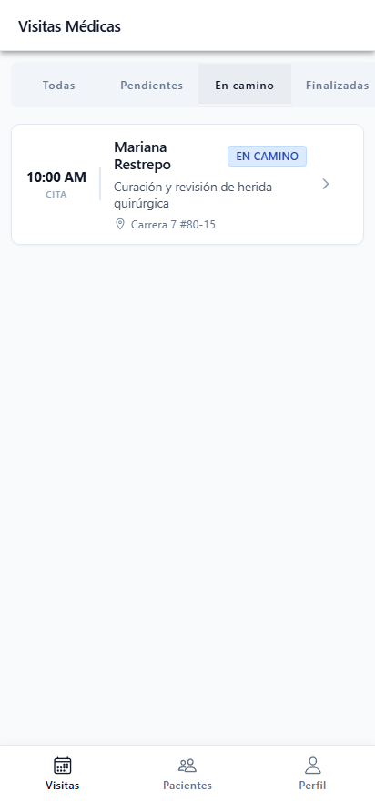 |

#### Ficha de Detalle y Actualización de Estado
| Detalle de la Cita Médica | Actualización de Estado con IonToast |
| :---: | :---: |
| 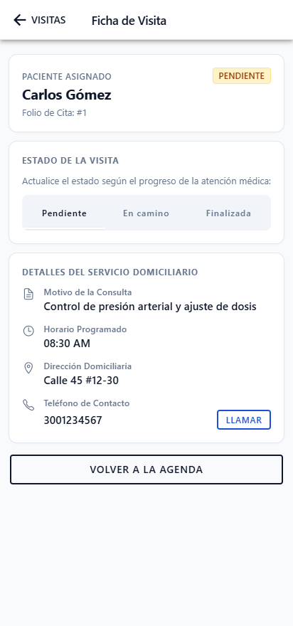 | 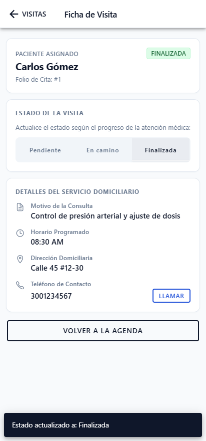 |

#### Tabs 2 y 3: Directorio de Pacientes y Perfil Médico
| Directorio de Pacientes | Búsqueda en Directorio | Perfil del Médico y Logout |
| :---: | :---: | :---: |
| 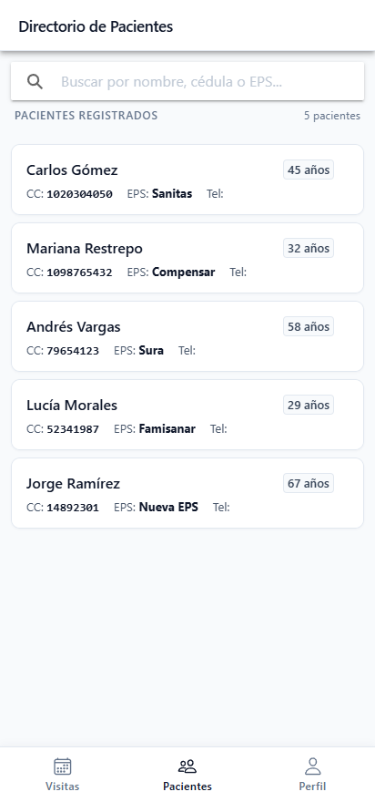 | 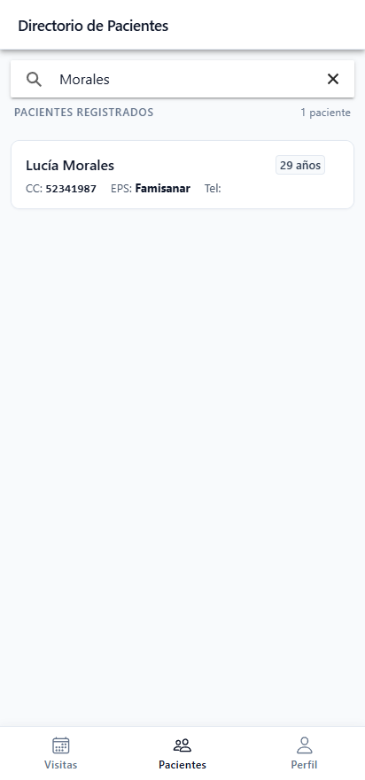 | 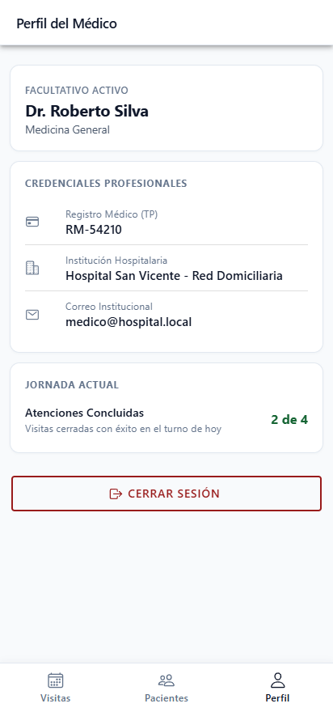 |

### 3. Credenciales de Prueba (Ionic App)
- **Usuario**: `medico@hospital.local`
- **Contraseña**: `123456`

### 4. Instrucciones de Ejecución
#### Modo Web / Desarrollo
```bash
cd "Ionic App"
npm install
npm run dev
```
La aplicación iniciará en: `http://localhost:5174/`

#### Sincronización y Compilación Nativa Android
```bash
cd "Ionic App"
npm run build
npx cap sync android
cd android
./gradlew assembleDebug
```
El archivo instalador APK se generará en:
`Ionic App/android/app/build/outputs/apk/debug/app-debug.apk`

---

## Reglas de Código y Estilo Aplicadas

1. **Cero Emojis**: Toda la interfaz de usuario, mensajes, componentes y documentación prescinden en su totalidad de emojis o iconos informales.
2. **Sin Backend**: La totalidad del almacenamiento y persistencia de datos opera de forma autónoma a través de `localStorage` del navegador y WebView.
3. **Ortografía y Lenguaje**: Todos los textos, botones y alertas cuentan con la debida acentuación ortográfica en español (á, é, í, ó, ú, ñ).
4. **Diseño Auténtico y Sobrio**: Interfaces profesionales, limpias y adaptadas a los estándares hospitalarios, evitando patrones artificiales o recargados.

---

## Datos de la Entrega

- **Estudiante**: José Brayner Minotta
- **Repositorio Remoto**: [https://github.com/jbrayner123/parcial-1-Jose_Brayner_minotta](https://github.com/jbrayner123/parcial-1-Jose_Brayner_minotta)
- **Ramas de Entrega**:
  - `parcial-1-jose-minotta` (nombre personalizado)
  - `parcial-1-nombre-apellido` (formato literal del enunciado)

Para alternar entre ramas o verificar el estado:
```bash
git checkout parcial-1-jose-minotta
git status
```
